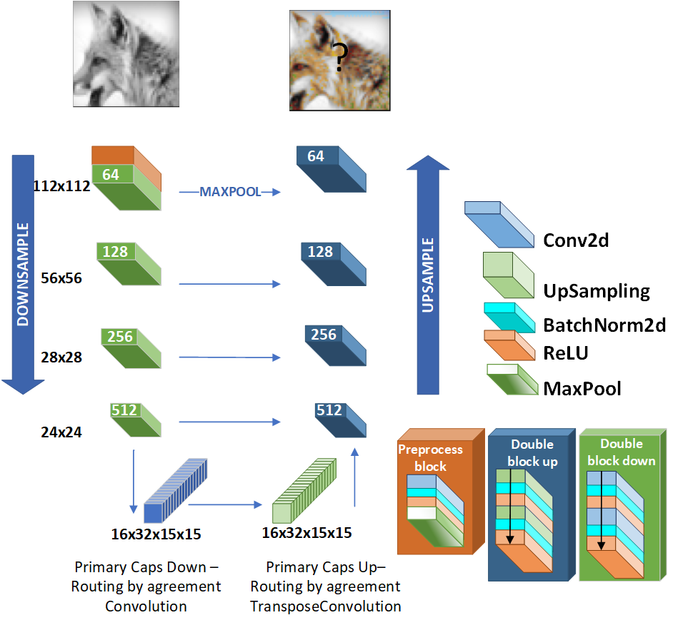

## Colourisation_w_Capsules
Project ColorCapsules: model based on capsules for colourization of greyscale images

# Is It a Plausible Colour? UCapsNet for Image Colourisation

Human beings can imagine the colours of a grayscale image with no particular effort thanks to their ability of semantic feature extraction. Can an autonomous system achieve that? Can it hallucinate plausible and vibrant colours?
This is the colourisation problem.
Different from existing works relying on convolutional neural network models pre-trained with supervision, we cast such colourisation problem as a self-supervised learning task.
We tackle the problem with the introduction of a novel architecture based on Capsules trained following the adversarial learning paradigm.
Capsule networks are able to extract a semantic representation of the entities in the image but loose details about their spatial information, which is important for colourising a grayscale image.
Thus our UCapsNet structure comes with an encoding phase that extracts entities through capsules and spatial details through convolutional neural networks.
A decoding phase merges the entity features with the spatial features to hallucinate a plausible colour version of the input datum.
Results on the ImageNet benchmark show that our approach is able to generate more vibrant and plausible colours than exiting solutions and achieves superior performance than models pre-trained with supervision.

Paper published at Self Supervised Learning workshop @ Neurips2020
https://sslneuips20.github.io/files/CameraReadys%203-77/45/CameraReady/NeurIPS_2020_camera_ready.pdf 

## Architecture and paper:

The architecture proposed in this repository is described as follow:

If you like to have more detailed information, plese read: https://arxiv.org/abs/2012.02478

## If you use our architecture for your study please refer us:

*Is It a Plausible Colour? UCapsNet for Image Colourisation*

*Rita Pucci, Christian Micheloni, Gian Luca Foresti, Niki Martinel*

*arXiv:2012.02478, 2020*

